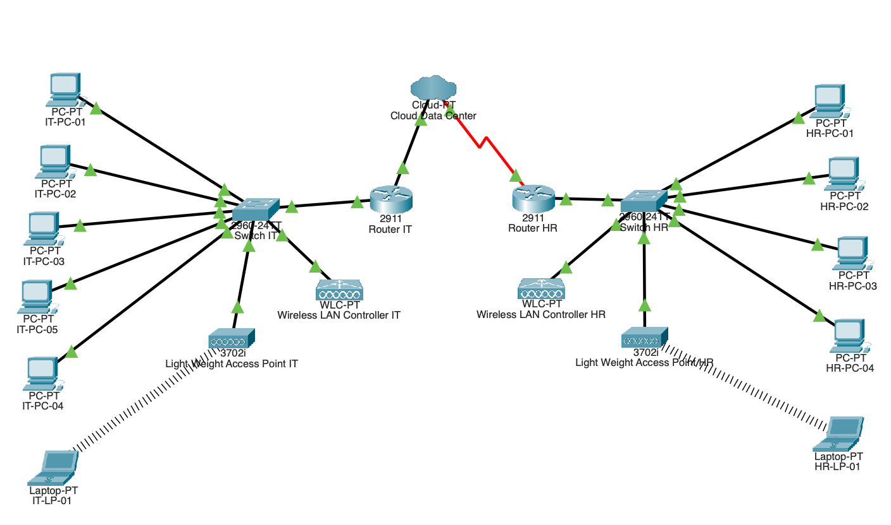
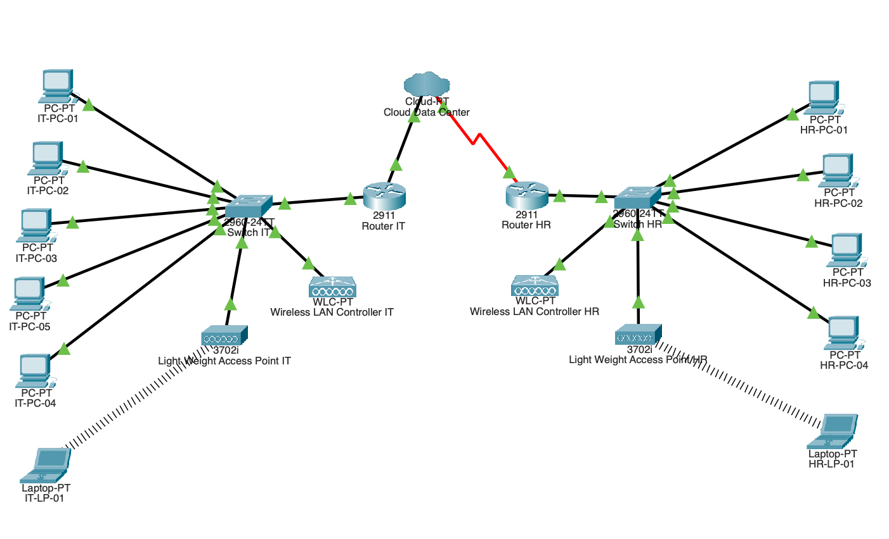
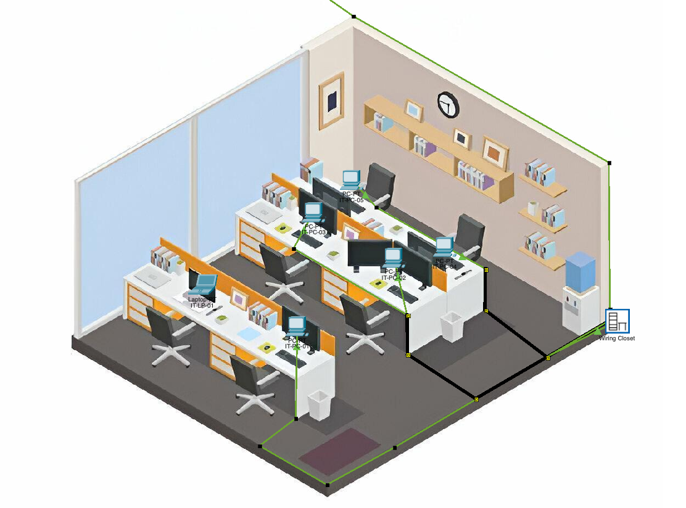
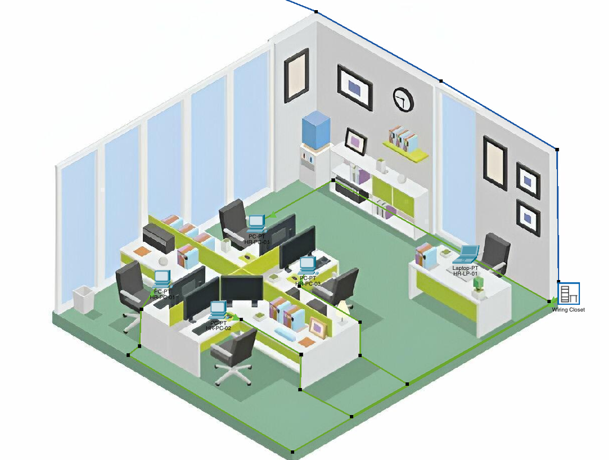

# 🌐 Enterprise Office Network Simulation

[](https://www.netacad.com/courses/packet-tracer)
[](https://github.com/jbimard/enterprise-office-network-simulation)
[](LICENSE)
[](https://github.com/jbimard/enterprise-office-network-simulation)

A comprehensive enterprise network infrastructure project featuring multi-site connectivity, VLAN segmentation, wireless management, and robust security implementations using Cisco Packet Tracer.



---

## 🎯 Overview

This project demonstrates the design and implementation of a **secure, scalable enterprise network infrastructure** connecting two office locations (IT and HR) through a cloud data center. The network is built entirely in Cisco Packet Tracer and showcases real-world networking concepts including routing, switching, wireless management, and multi-layered security.

### Project Scope

The project simulates a medium-sized organization with:
- **Two physical office locations** (IT Office & HR Office)
- **Multi-site WAN connectivity** via Cloud Data Center
- **50+ network devices** including routers, switches, WLCs, APs, and end devices
- **Comprehensive security** through VLAN segmentation, ACLs, and wireless encryption
- **Centralized services** including DHCP, DNS, file sharing, and wireless management

---

## 🎯 Project Objectives

1. **Design a functional multi-site network** connecting IT and HR offices with seamless inter-office communication
2. **Configure enterprise-grade networking equipment** including Cisco routers, switches, WLCs, and lightweight APs
3. **Implement VLAN segmentation** for network isolation, security, and broadcast domain control
4. **Deploy wireless infrastructure** with centralized management and secure authentication
5. **Apply security best practices** including ACLs, device hardening, and encrypted wireless access
6. **Document the complete infrastructure** for maintenance, troubleshooting, and knowledge transfer

---

## 🏗️ Network Architecture

### Physical Layout
- **IT Office**: Central technical hub with core networking equipment
- **HR Office**: Dedicated office space with local switching and wireless coverage
- **Cloud Data Center**: WAN interconnection point providing inter-office routing

### Logical Design
- **Layer 2 Switching**: VLAN segmentation across departments
- **Layer 3 Routing**: Inter-VLAN routing and WAN connectivity
- **Wireless Infrastructure**: Centrally managed lightweight APs with controller-based architecture
- **Network Services**: DHCP, DNS, file services, and print services

---

## ✨ Key Features

### 🔌 Network Infrastructure
- Multi-site WAN connectivity using serial links
- Redundant switching architecture for high availability
- Centralized wireless management with WLC
- Structured IP addressing and subnetting

### 🔐 Security
- **VLAN Segmentation**: 4 VLANs isolating management, HR, employee wireless, and guest wireless traffic
- **Access Control Lists (ACLs)**: Router-based traffic filtering between VLANs
- **Wireless Security**: WPA2-Enterprise for employees, WPA2-Personal for guests
- **Device Hardening**: SSH-only management, disabled unused ports, strong passwords

### 📡 Wireless Services
- Controller-based wireless architecture (CAPWAP)
- Multiple SSIDs with VLAN tagging
- Guest network isolation with internet-only access
- Enterprise authentication for employee devices

### 🛠️ Network Services
- **DHCP**: Dynamic IP allocation from centralized router
- **DNS**: Internal hostname resolution
- **File Server**: Centralized document storage with departmental folders
- **Print Services**: Network-attached printer in HR office

---

## 💻 Technologies Used

| Category | Technology |
|----------|-----------|
| **Simulation Platform** | Cisco Packet Tracer 8.x |
| **Routing** | Cisco 2911 ISR Routers |
| **Switching** | Cisco Catalyst 2960 Switches |
| **Wireless** | Wireless LAN Controllers (WLC), Lightweight Access Points (LWAP) |
| **Protocols** | TCP/IP, DHCP, DNS, SSH, CAPWAP, SNMP |
| **Security** | VLANs, ACLs, WPA2-Enterprise, WPA2-Personal |
| **Services** | DHCP Server, DNS Server, File Server, Print Server |

---

## 🗺️ Network Topology

### High-Level Architecture

```
┌─────────────────────────────────────────────────────────────┐
│                    Cloud Data Center                        │
│                  (WAN Interconnection)                      │
└────────────┬───────────────────────────┬────────────────────┘
             │                           │
    Serial0/3/0                    Serial0/3/1
             │                           │
   ┌─────────▼────────┐        ┌────────▼─────────┐
   │   IT Office      │        │   HR Office      │
   │   Router         │        │   Switch         │
   │  192.168.1.1     │        │  192.168.1.20    │
   └─────────┬────────┘        └────────┬─────────┘
             │                           │
      ┌──────┴──────┐              ┌────┴─────┐
      │             │              │          │
  IT Switch    IT WLC          HR AP     HR PCs
  (Layer 2)  (Wireless)      (Wireless) (1-20)
      │           │
   IT APs      IT PCs
  (LWAP)      (1-20)
```

### VLAN Architecture

```
VLAN 1  (Default/Management)  → IT infrastructure devices
VLAN 2  (HR Department)       → HR office devices
VLAN 10 (Employee Wireless)   → Authenticated employee devices
VLAN 20 (Guest Wireless)      → Guest internet-only access
```

---

## 📊 IP Addressing Scheme

### Network: 192.168.1.0/24

| Device Type | IP Range | Example/Notes |
|-------------|----------|---------------|
| **Routers** | 192.168.1.1 | IT Office default gateway |
| **Switches** | 192.168.1.2 - 192.168.1.9 | Layer 3 management IPs |
| **WLC** | 192.168.1.3 | Wireless LAN Controller |
| **Servers** | 192.168.1.10 - 192.168.1.29 | DNS, File, Print servers |
| **HR Switch** | 192.168.1.20 | HR office local switch |
| **IT Workstations** | 192.168.1.50 - 192.168.1.59 | Static IPs for IT PCs |
| **HR Workstations** | 192.168.1.60 - 192.168.1.80 | Static IPs for HR PCs |
| **HR Printer** | 192.168.1.81 | Network printer |
| **DHCP Pool** | 192.168.1.101 - 192.168.1.199 | Dynamic allocation |
| **Wireless Devices** | 192.168.1.200 - 192.168.1.254 | DHCP for wireless clients |

### Subnet Details
- **Network Address**: 192.168.1.0
- **Subnet Mask**: 255.255.255.0 (/24)
- **Default Gateway**: 192.168.1.1
- **DNS Server**: 192.168.1.10
- **Usable Hosts**: 254

---

## 🔀 VLAN Configuration

### VLAN Breakdown

| VLAN ID | Name | Purpose | Devices |
|---------|------|---------|---------|
| **1** | Default/Management | Network infrastructure management | Switches, Routers, WLC |
| **2** | HR_Department | Human Resources traffic isolation | HR PCs, HR Printer, HR Switch |
| **10** | Employee_Wireless | Authenticated employee devices | Corporate laptops, phones |
| **20** | Guest_Wireless | Guest internet access (isolated) | Visitor devices |

### Security Benefits
- **Traffic Isolation**: HR data separated from IT infrastructure
- **Broadcast Control**: Reduced broadcast domains improve performance
- **Policy Enforcement**: Different security policies per VLAN
- **Guest Segmentation**: Guests cannot access internal resources

---

## 🔐 Security Implementation

### 1️⃣ Network Segmentation
- VLANs isolate traffic between departments and device types
- Inter-VLAN routing controlled by ACLs on core router
- Guest VLAN has no access to internal VLANs

### 2️⃣ Access Control Lists (ACLs)
```
HR VLAN (2)     → Access to HR servers and printers only
IT VLAN (1)     → Full network access for administration
Guest VLAN (20) → Internet access only, all internal traffic blocked
```

### 3️⃣ Wireless Security
- **Employee SSID**: WPA2-Enterprise with RADIUS authentication
- **Guest SSID**: WPA2-Personal with pre-shared key
- **VLAN Tagging**: Automatic VLAN assignment based on SSID
- **Controller Management**: Centralized policy enforcement

### 4️⃣ Device Hardening
- SSH enabled, Telnet disabled on all management devices
- Strong passwords enforced (minimum 12 characters)
- Unused switch ports disabled
- Console password protection enabled

### 5️⃣ Perimeter Security
- Router ACLs filter traffic between internal network and cloud
- Only necessary services (DNS, HTTP/HTTPS) permitted outbound
- Inbound traffic restricted to established connections

---

## 🚀 Installation & Setup

### Prerequisites
- **Cisco Packet Tracer** 8.0 or later ([Download here](https://www.netacad.com/courses/packet-tracer))
- Basic understanding of networking concepts (routing, switching, VLANs)

### Steps to Run

1. **Clone the repository**
   ```bash
   git clone https://github.com/jbimard/enterprise-office-network-simulation.git
   cd enterprise-office-network-simulation
   ```

2. **Open the Packet Tracer file**
   - Launch Cisco Packet Tracer
   - Open `enterprise-network.pkt` from the repository

3. **Explore the network**
   - Switch between Physical and Logical views
   - Click on devices to view configurations
   - Use simulation mode to test connectivity

4. **Test connectivity**
   - Ping between IT and HR offices
   - Test DHCP assignments
   - Verify VLAN isolation
   - Test wireless connectivity

### Testing Scenarios

| Test | Expected Result |
|------|-----------------|
| IT PC → HR PC | ✅ Success (inter-VLAN routing enabled) |
| Guest Wireless → Internal Server | ❌ Blocked by ACL |
| HR PC → File Server | ✅ Success (shared resource access) |
| Wireless Client → Internet | ✅ Success via router NAT |

---

## 📚 Documentation

### Project Files

```
enterprise-office-network-simulation/
│
├── README.md                          # This file
├── enterprise-network.pkt             # Cisco Packet Tracer simulation file
│
├── docs/
│   ├── Network_Infrastructure_Project_Documentation.pdf
│   ├── configuration-guide.md         # Device configuration details
│   ├── troubleshooting-guide.md       # Common issues and solutions
│   └── images/                        # Network diagrams and screenshots
│       ├── logical-topology.png
│       ├── physical-layout-it.png
│       ├── physical-layout-hr.png
│       └── vlan-diagram.png
│
├── configs/
│   ├── router-it-config.txt           # IT Router running config
│   ├── switch-it-config.txt           # IT Switch running config
│   ├── switch-hr-config.txt           # HR Switch running config
│   └── wlc-config.txt                 # Wireless Controller config
│
└── scripts/
    ├── dhcp-pool-setup.txt            # DHCP configuration commands
    ├── vlan-setup.txt                 # VLAN configuration commands
    └── acl-setup.txt                  # ACL configuration commands
```

### Additional Documentation
- [📖 Full Project Documentation (PDF)](docs/Network_Infrastructure_Project_Documentation.pdf)
- [⚙️ Configuration Guide](docs/configuration-guide.md)
- [🔧 Troubleshooting Guide](docs/troubleshooting-guide.md)

---

## 🎓 Skills Demonstrated

This project showcases proficiency in:

### Networking Fundamentals
- ✅ OSI Model and TCP/IP stack
- ✅ IP addressing and subnetting (CIDR notation)
- ✅ Routing protocols and inter-VLAN routing
- ✅ Switching concepts (VLANs, trunking, STP)

### Enterprise Technologies
- ✅ Cisco router and switch configuration
- ✅ Wireless LAN Controller (WLC) setup
- ✅ Lightweight Access Point (LWAP) deployment
- ✅ CAPWAP protocol implementation

### Security
- ✅ VLAN segmentation for traffic isolation
- ✅ Access Control Lists (ACLs) for traffic filtering
- ✅ WPA2-Enterprise and WPA2-Personal wireless encryption
- ✅ Device hardening and secure management practices

### Network Services
- ✅ DHCP server configuration and scope management
- ✅ DNS server setup for internal resolution
- ✅ File and print services deployment
- ✅ Network Address Translation (NAT)

### Documentation
- ✅ Technical documentation and network diagrams
- ✅ Configuration management and version control
- ✅ Troubleshooting procedures and knowledge base

---

## 🔮 Future Enhancements

Potential improvements and expansions for this project:

- [ ] **Add redundancy**: Implement HSRP/VRRP for router redundancy
- [ ] **Dynamic routing**: Replace static routes with OSPF or EIGRP
- [ ] **Advanced security**: Add firewall appliances (ASA) for stateful inspection
- [ ] **VPN connectivity**: Site-to-site IPsec VPN between offices
- [ ] **QoS implementation**: Prioritize voice and video traffic
- [ ] **Network monitoring**: Add SNMP, Syslog, and NetFlow monitoring
- [ ] **IPv6 deployment**: Dual-stack configuration for IPv4/IPv6
- [ ] **IDS/IPS**: Intrusion detection and prevention systems
- [ ] **Load balancing**: Implement load balancers for server farms
- [ ] **SD-WAN**: Software-defined WAN for dynamic path selection

---

## 👨‍💻 Author

**Joseph Posas**
- 🎓 Cybersecurity / Networking Program
- 💼 [LinkedIn](https://www.linkedin.com/in/josephposas/)
- 🐙 [GitHub](https://github.com/jbimard)

---

## 🙏 Acknowledgments

- Cisco Networking Academy for Packet Tracer
- Intercity Networks for project requirements
- Network design inspired by enterprise best practices

---

## 📸 Screenshots

### Logical Network Topology


### IT Office Physical Layout


### HR Office Physical Layout


### VLAN Configuration


---

<div align="center">

**⭐ Star this repository if you find it helpful!**


</div>
